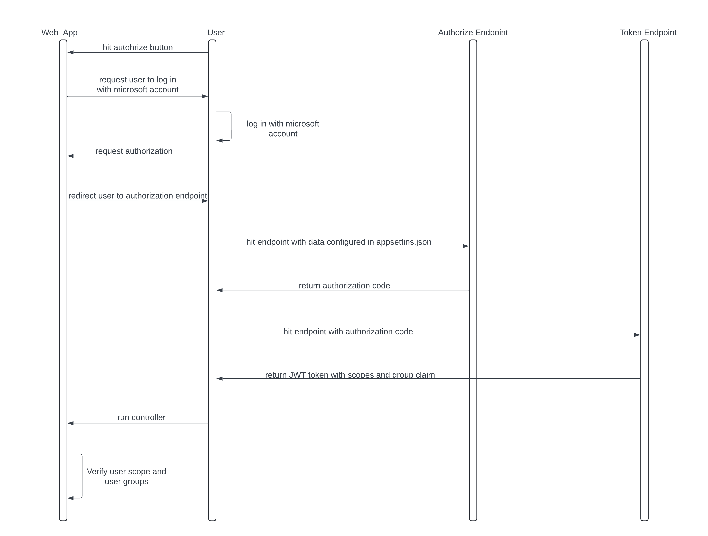

# <a name="_hlk162351708"></a>Azure Configuration:
**List of app registrations and enterprise application with a description of the configuration process:**

**[1 is backend for authentication:](https://portal.azure.com/#view/Microsoft_AAD_RegisteredApps/ApplicationMenuBlade/~/Overview/appId/92b6eff0-dbed-43b7-8abd-2496511c6a00/isMSAApp~/false)**

1) Token configuration – groups claim is added, because of this in the bearer token, we can see the IDs of groups that the user is assigned to inside claims. While adding this optional claim the option “Groups assigned to the application (recommended for large enterprise companies to avoid exceeding the limit on the number of groups a token can emit)” was selected, otherwise we were getting too many groups and instead of ID’s we were getting an endpoint that we needed to call for information.
1) Expose an API – a new scope was created that is used by our second app registration.
	Second app registration was added as an authorized client application.
1) App roles – two roles were added, one for FAST members and one for outside users.

**[2 is for UI interactions with oauth2:](https://portal.azure.com/#view/Microsoft_AAD_RegisteredApps/ApplicationMenuBlade/~/Overview/appId/29cd79cb-1dd7-4ca0-814a-679912fa10d6/isMSAApp~/false)**

1) Authentication – for each web app/UI there is a need to add a redirect URI, for example, a new redirect URI: <https://app-fasapi-eastus-reg.azurewebsites.net/oauth2-redirect.html> needs to be added for a web app: [app-fasapi-eastus-reg.azurewebsites.net](https://app-fasapi-eastus-reg.azurewebsites.net/).
1) Api permissions – new permission was added based on step 2) for 1<sup>st</sup> app registration

**[3 is for specifying groups that should have access:](https://portal.azure.com/#view/Microsoft_AAD_IAM/ManagedAppMenuBlade/~/Overview/objectId/bcfa1930-dd87-4e9c-9c25-886888ad3636/appId/92b6eff0-dbed-43b7-8abd-2496511c6a00/preferredSingleSignOnMode~/null/servicePrincipalType/Application/fromNav/)** 

1) Users and groups – A FAST group was added. Combining this and 1) step from 1<sup>st</sup> app registration allows us to get groups in claims.

**This is an example of configuration from our regression**  

# oauth2 schema


**Template of call to Authorize Endpoint:**  
```
https://login.microsoftonline.com/8afe73f9-0d93-4821-a898-c5c2dc320953/oauth2/v2.0/authorize?  
client_id=92b6eff0-dbed-43b7-8abd-2496511c6a00  
&response_type=code&redirect_uri=&lt;taken from UI app registration&gt;  
&scope=api://92b6eff0-dbed-43b7-8abd-2496511c6a00/AccessApi  
```

**Template of call to Token Endpoint:**  
```
POST /8afe73f9-0d93-4821-a898-c5c2dc320953/oauth2/v2.0/token HTTP/1.1  
Host: login.microsoftonline.com  
Content-Type: application/x-www-form-urlencoded  

client_id=92b6eff0-dbed-43b7-8abd-2496511c6a00  
&grant_type=authorization_code  
&code=<authorization_code_received_from_authorization_server>  
&redirect_uri=&lt;taken from UI app registration&gt;  
&scope=api://92b6eff0-dbed-43b7-8abd-2496511c6a00/AccessApi  
&client_secret=<client_secret_for_confidential_clients>  
```

# Code description
## Appsettings.json

**AzureAd**: collection of information about [Azure AD](https://portal.azure.com/#view/Microsoft_AAD_RegisteredApps/ApplicationMenuBlade/~/Overview/appId/92b6eff0-dbed-43b7-8abd-2496511c6a00/isMSAApp~/false)
```
"AzureAd": {
		"Instance": "https://login.microsoftonline.com/",
		"Domain": "kcura.onmicrosoft.com",
		"TenantId": "8afe73f9-0d93-4821-a898-c5c2dc320953",
		"ClientId": "92b6eff0-dbed-43b7-8abd-2496511c6a00",
		"Scopes": "AccessApi",
		"CallbackPath": "/signin-oidc",
		"SignedOutCallBackPath": "/signout-callback-oidc"
	}
```

- "Instance": The URL of the Azure AD instance. 
- "Domain": The domain of Azure AD tenant.
- "TenantId": The ID of Azure AD tenant.
- "ClientId": The ID of the Azure AD application. This is the application that users will be authenticating against.
- "Scopes": The scopes that the application requires. 
- "CallbackPath": The path in an application where users will be redirected after they authenticate with Azure AD
- "SignedOutCallBackPath": The path in an application where users will be redirected after they sign out.

**SwaggerAzureAd**: collection of information about [app registration responsible for UI’s OAuth2 integration](https://portal.azure.com/#view/Microsoft\_AAD\_RegisteredApps/ApplicationMenuBlade/~/Overview/appId/29cd79cb-1dd7-4ca0-814a-679912fa10d6/isMSAApp~/false).

```
"SwaggerAzureAd": {
		"ClientId": "29cd79cb-1dd7-4ca0-814a-679912fa10d6",
		"Authorization": "https://login.microsoftonline.com/8afe73f9-0d93-4821-a898-c5c2dc320953/oauth2/v2.0/authorize",
		"TokenUrl": "https://login.microsoftonline.com/8afe73f9-0d93-4821-a898-c5c2dc320953/oauth2/v2.0/token",
		"Scope": "api://92b6eff0-dbed-43b7-8abd-2496511c6a00/AccessApi"
	}
```

- "ClientId": The ID of the Azure AD application. This is the application that Swagger UI will be authenticating against.
- "Authorization": The URL of the Azure AD authorization endpoint. This is where Swagger UI will redirect users to authenticate. 
- "TokenUrl": The URL of the Azure AD token endpoint. This is where Swagger UI will request access tokens. 
- "Scope": The scope that Swagger UI requires.

To get Authorization and TokenUrl go to:
Microsoft Entra ID -> app registrations -> Endpoint (menu on top of the website)

To get Scope:
go to app registration form AzureAd then go to Expose an API and there are scopes with value you can copy

## Program.cs
```
setup.AddSecurityDefinition("oauth2", new OpenApiSecurityScheme
	{
		Description = "In order to authorize please select scope named \"Access API as a user\"",
		Name = "oauth2.0",
		Type = SecuritySchemeType.OAuth2,
		Flows = new OpenApiOAuthFlows()
		{
			AuthorizationCode = new OpenApiOAuthFlow
			{
				AuthorizationUrl = new Uri(builder.Configuration["SwaggerAzureAd:Authorization"]),
				TokenUrl = new Uri(builder.Configuration["SwaggerAzureAd:TokenUrl"]),
				Scopes = new Dictionary<string, string>
				{
					{builder.Configuration["SwaggerAzureAd:Scope"], "Access API as a user"}
				}
			}
		}
	});
	setup.AddSecurityRequirement(new OpenApiSecurityRequirement
	{
		{
			new OpenApiSecurityScheme
			{
				Reference = new OpenApiReference{Type = ReferenceType.SecurityScheme, Id = "oauth2"}
			},
			new [] {builder.Configuration["SwaggerAzureAd:Scope"]}
		}
	});
```
This code is used in Swagger to handle the whole communication process.  
Values are passed from appsettings.json file

# Maintenance:
**To allow more groups to authenticate:**

1) Create new app role in [1<sup>st</sup> app registration](https://portal.azure.com/#view/Microsoft_AAD_RegisteredApps/ApplicationMenuBlade/~/Overview/appId/29cd79cb-1dd7-4ca0-814a-679912fa10d6/isMSAApp~/false)
1) Add group to [enterprise application (3<sup>rd</sup> app)](https://portal.azure.com/#view/Microsoft_AAD_IAM/ManagedAppMenuBlade/~/Overview/objectId/bcfa1930-dd87-4e9c-9c25-886888ad3636/appId/92b6eff0-dbed-43b7-8abd-2496511c6a00/preferredSingleSignOnMode~/null/servicePrincipalType/Application/fromNav/)  
In the Getting Started section, there will be Assign Users and Groups or click Users and Groups on the menu on the left side
1) Add the ID of this group to appsettings.json in the AuthGroups section
1) Add a check for a new group in the IsAuthorizedByGroupMembershipFromToken method in AuthWithAzureGroup.cs

**To allow the new web app to authenticate:**

For each web app/UI, there is a need to add a redirect URI.  
For example, if a new web app/UI named **test-web-app** was created:
1) Go to [app registration responsible for UI](https://portal.azure.com/#view/Microsoft_AAD_RegisteredApps/ApplicationMenuBlade/~/Overview/appId/29cd79cb-1dd7-4ca0-814a-679912fa10d6/isMSAApp~/false)
1) Follow this steps: Authentication -> "+ add a platform" -> Single-page-application  
1) Enter Redirect-URI like: <https://test-web-app.azurewebsites.net/oauth2-redirect.html>

